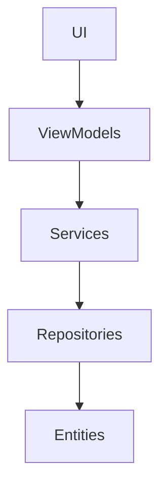

# Project Summary – Wrecept

## 1. Modules Overview

| Module | Purpose | Layer | Owned by |
|-------|---------|-------|---------|
| `src/ViewModels` | View-model logic, MVVM glue | MVVM | CodeGen-CSharp |
| `src/Views` | XAML views and dialogs | UI | CodeGen-XAML |
| `src/Infrastructure` | EF Core repositories, settings, helpers | Persistence | CodeGen-CSharp |
| `src/Services` | Application services and navigation | Domain/Service | CodeGen-CSharp |
| `src/Themes` | Resource dictionaries for light/dark themes | Styling | CodeGen-XAML |
| `src/Resources` | Localisation strings (hu/en) | Shared | CodeGen-XAML |
| `src/Wrecept.Core.CoreLib` | Entities and repository interfaces | Core Library | CodeGen-CSharp |
| `src/Wrecept.Core` | Default service implementations | Core Services | CodeGen-CSharp |
| `src/Wrecept.Plugin.Greeting` | Sample IMenuPlugin implementation | Plugin | CodeGen-CSharp |
| `tests` | xUnit and UI tests | QA | TestWriter |

## 2. View Hierarchy

```
MainWindow
 └── InvoiceEditorWindow
       ├── InvoiceSidebar
       ├── InvoiceHeader
       ├── InvoiceItemsGrid
       └── InvoiceSummary
```
Additional windows: `SettingsWindow`, `HelpWindow`, `AboutWindow`, lookup dialogs and filter dialogs.

## 3. Dependencies



## 4. Keyboard Input Routing

| Key Combo | Function | Handled in |
|-----------|----------|-----------|
| Ctrl+S | Save current invoice | `InvoiceEditorViewModel` |
| Esc | Cancel / exit | `InvoiceEditorViewModel` and dialogs |
| F1 | Help overlay | `HelpWindow` |
| Tab | Field navigation | All views |
| F2 or Ctrl+L | Open lookup dialogs | `InvoiceItemRowViewModel` |

## 5. Task Mapping

| Area | Agent | Reference Files |
|------|-------|----------------|
| New XAML layout | CodeGen-XAML | `src/Views/**`, `docs/themes.md` |
| New ViewModel logic | CodeGen-CSharp | `src/ViewModels/**` |
| UX flow review | ux_agent | `docs/ui_flow.md` |
| Error message updates | DocWriter | `docs/user_manual_hu.md` |
| Keyboard handling | CodeGen-CSharp | `InvoiceEditorWindow.xaml.cs`, `*ViewModel.cs` |

## 6. Agent Workflow Guidelines

All agents MUST consult this SUMMARY.md before performing file analysis or code generation. The following conventions apply:

- Agents should **not modify layers above their ownership scope** unless explicitly instructed.
- For **feature implementations**, follow this sequence:
  1. Update or create the relevant ViewModel in `src/ViewModels`
  2. Update XAML or create new views in `src/Views`
  3. Wire services via `src/Services` using interfaces from `Wrecept.Core.CoreLib`
  4. Register new dependencies via `AppContext.java` (or equivalent bootstrapper)

### Example Agent Map

| Task | Trigger File | Responsible Agent | Notes |
|------|---------------|-------------------|-------|
| New field in invoice | `InvoiceEditorViewModel.cs` | CodeGen-CSharp | Update `InvoiceItemsGrid.xaml` accordingly |
| New plugin | `Plugin` directory | PluginAgent | Register in plugin loader |
| Localization | `Resources/messages_*.resx` | DocWriter | Follow i18n conventions |

### References in AGENTS.md

Each section in AGENTS.md (root_agent, ui_agent, etc.) should include a `project_map` reference to `docs/SUMMARY.md` and confirm compliance before task execution.

> Agents violating these scope boundaries may produce side effects and will be terminated by root_agent.
